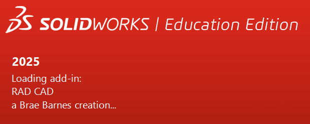

The RAD CAD installer works by adding dynamic link library (dll) files to the SolidWorks source files. This requires administrative privileges. 

To start, download the zip file [here](downloadables/RAD_CAD_Installer_V3.5.zip).

  

## Installation Instructions

Once you have downloaded and unzipped the zip file, find the file called "RUN_ME_as_admin_to_install." If you would like to verify that this file contains nothing malicious, you can open it as a text file to see its contents. All it does is register this add in with SolidWorks and remove any old versions of the add in.

Run this file as admin. This will likely bring up a warning not to trust this program since it is a raw batch file, but you have to click run anyways and it will work. To find the "run anyways" button you may need to click a "more info" or some similar option on the warning page that pops up. This should install RAD CAD into SolidWorks!

If you do not see it in SolidWorks by default, you may need to enable it in the add-in manager.
​
## Uninstallation Instructions

Similar to installation, simply find the file titled "RUN_ME_as_admin_to_UNinstall." Run this file with admin in the same release folder and it will uninstall RAD CAD from your SolidWorks